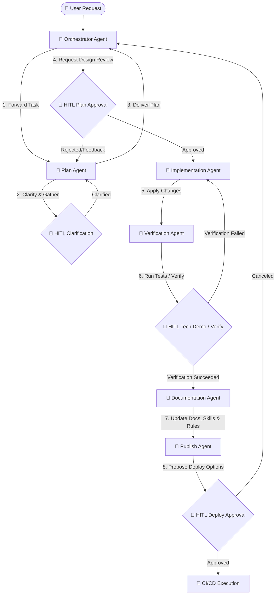

# 🤖 CloudApi Agentic Workflow Team

Welcome to the **CloudApi Agentic Team** specification. This framework defines a highly coordinated team of specialized AI agents designed to handle the end-to-end software development lifecycle (SDLC) for the CloudApi project. 

The goal of this system is to maximize code quality, maintain rigorous testing standards, document every change, and ensure a safe, human-controlled pathway from requirements to production deployment.

---

## 🏗️ Multi-Agent Interaction Workflow

The following Mermaid diagram illustrates the step-by-step lifecycle of a task moving through the agentic team, including critical **Human-in-the-Loop (HITL)** gates.

---

## 👥 The Agent Team

Each agent has a dedicated instruction file containing their specific system prompts, boundaries, run-books, and tools.

| Agent | Purpose | Key HITL Gate | File Link |
| :--- | :--- | :--- | :--- |
| **🤖 Orchestrator** | Receives tasks, coordinates agents, manages the state, and owns final delivery. | Final validation hand-off | [orchestrator.md](file:///Users/y/Projects/CloudApi/.gemini/agents/orchestrator.md) |
| **📋 Plan Agent** | Gathers requirements, analyzes codebase impact, and asks clarification questions. | Ambiguity resolution & Plan approval | [plan.md](file:///Users/y/Projects/CloudApi/.gemini/agents/plan.md) |
| **💻 Implementation** | Modifies backend/frontend codebase strictly following the approved design. | Code diff validation | [implementation.md](file:///Users/y/Projects/CloudApi/.gemini/agents/implementation.md) |
| **🧪 Verification** | Runs automated tests in emulator environments and verifies acceptance criteria. | Interactive test verification | [verification.md](file:///Users/y/Projects/CloudApi/.gemini/agents/verification.md) |
| **📝 Documentation** | Updates arc42 architecture, schemas, guides, and auto-generates AI instructions/skills. | Documentation review | [documentation.md](file:///Users/y/Projects/CloudApi/.gemini/agents/documentation.md) |
| **🚀 Publish Agent** | Handles Terraform provisioning, GCP builds, and staging/prod rollouts. | **Strict gate** prior to any state-modifying deploy | [publish.md](file:///Users/y/Projects/CloudApi/.gemini/agents/publish.md) |

---

## ⚡️ Key Architecture Principles

1. **Isolation of Concerns**: The *Implementation Agent* does not verify its own code. The *Verification Agent* has exclusive responsibility for testing and reporting test health.
2. **Deterministic Emulation**: All verification is executed against real local emulator environments (Firestore, Auth) to prevent "works on my machine" failures without touching production data.
3. **No Phantom Deploys**: The *Publish Agent* is heavily sandboxed. Running live Terraform or deploying scripts requires explicit, authenticated human approval.
4. **Self-Documenting Codebase**: The *Documentation Agent* updates both human docs (`arc42.md`) and AI-facing rules (`GEMINI.md`, Cursor `.mdc` rules, and Cursor `skills/`) in parallel with any code modification.
