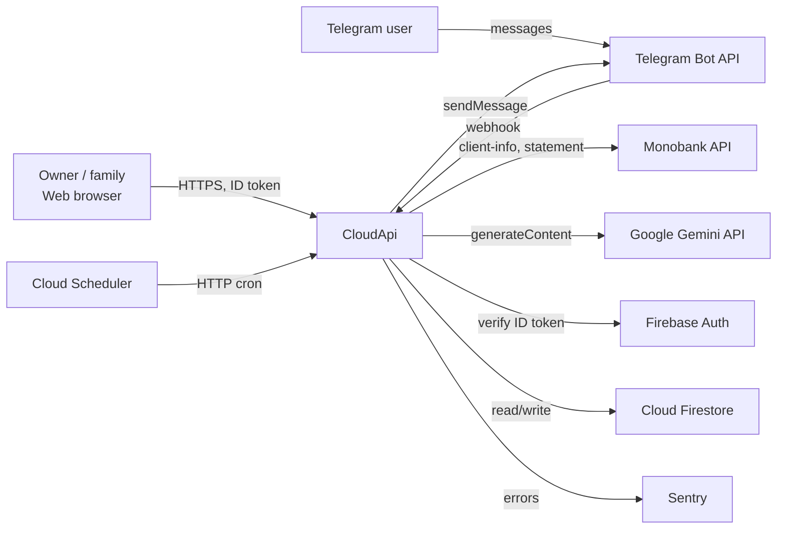
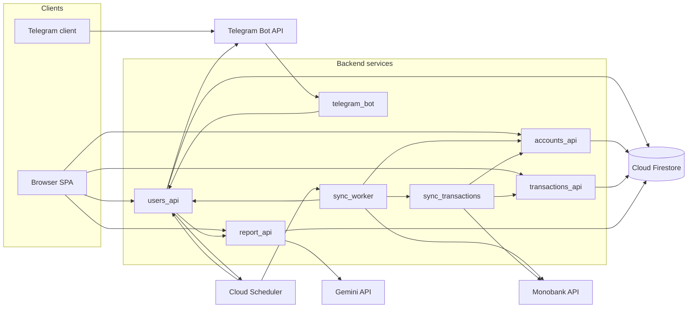
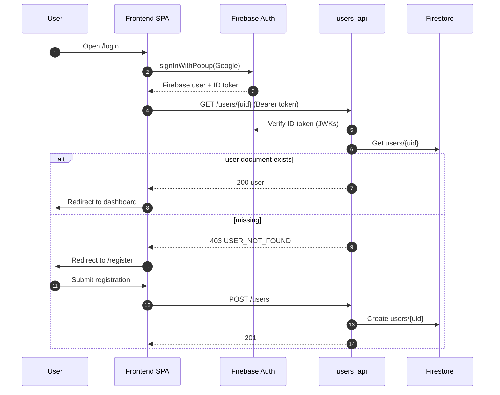
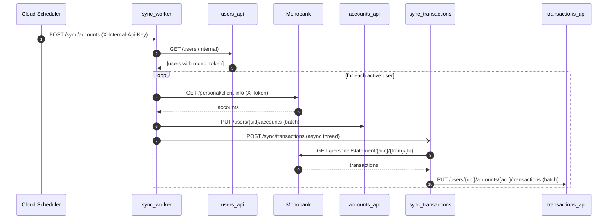
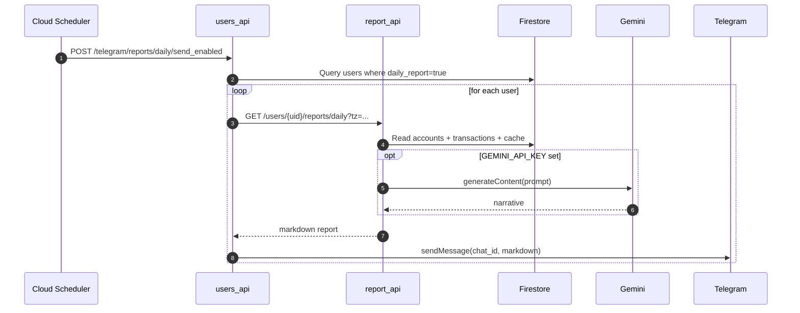
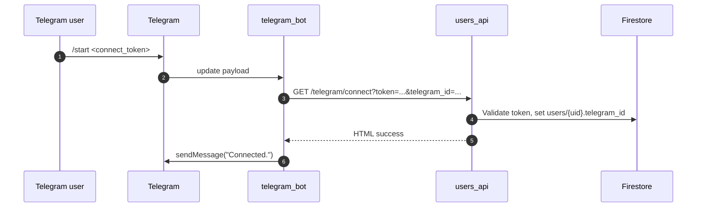
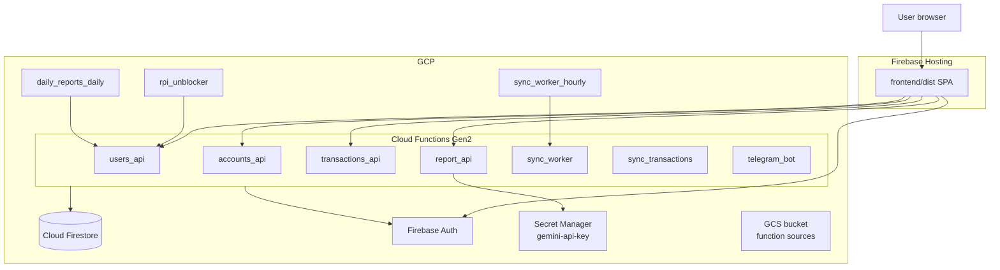
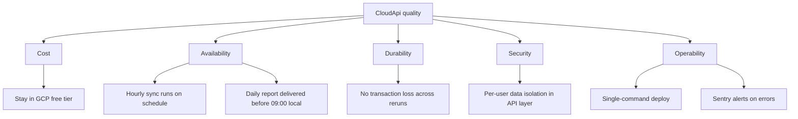

# CloudApi — arc42 Architecture Documentation

> Single-document arc42 description of CloudApi: a personal Monobank
> aggregator with a React web UI and a Telegram bot, running on GCP Cloud
> Functions. Cloud Firestore is the shared data plane.

## Table of contents

**Maintenance**

- [Document conventions and maintenance](#document-conventions-and-maintenance)

**arc42 sections**

1. [Introduction and Goals](#1-introduction-and-goals)
2. [Architecture Constraints](#2-architecture-constraints)
3. [System Scope and Context](#3-system-scope-and-context)
4. [Solution Strategy](#4-solution-strategy)
5. [Building Block View](#5-building-block-view)
6. [Runtime View](#6-runtime-view)
7. [Deployment View](#7-deployment-view)
8. [Cross-cutting Concepts](#8-cross-cutting-concepts)
9. [Architecture Decisions](#9-architecture-decisions)
10. [Quality Requirements](#10-quality-requirements)
11. [Risks and Technical Debt](#11-risks-and-technical-debt)
12. [Glossary](#12-glossary)

---

## Document conventions and maintenance

This file is the **living** architecture description. Treat it as part of the codebase, not a one-off deliverable.

### When to edit (same PR as the code)

| Change | Update these sections |
|--------|------------------------|
| New or removed external system (API, provider, observability) | §3, §5, possibly §7 |
| New backend service or renamed responsibility | §5, §6 if flows change |
| New user-visible or scheduled flow | §6 (sequence), §5 diagram if edges change |
| New deploy target, env, or infra resource | §7, §8 (configuration) |
| Auth, family access, internal call pattern, or secrets handling | §8, §11 if risk profile shifts |
| Material architectural choice | §9 — add **ADR-N** (append-only). Supersede an earlier ADR with a new ADR that references the old one; do not delete old ADRs. |
| Mitigated risk (e.g. tightened `firestore.rules`) | §11 — remove or mark resolved with date |
| New domain term | §12 |

### What not to duplicate here

- **Per-endpoint catalogs** — prefer `docs/users_api.md`, `docs/sync_worker.md`, and route tables in code; arc42 summarizes boundaries and links to sources.
- **Field-by-field Firestore schema** — canonical detail lives in [firestore_schema.md](firestore_schema.md).

### Review cadence

- **On every meaningful PR** that touches architecture triggers above.
- **Quarterly skim** — does §4 still match how the system runs? If not, either fix the doc or fix the drift in implementation.

### Agentic / Cursor usage

Project rule [.cursor/rules/architecture.mdc](../.cursor/rules/architecture.mdc) nudges agents to read this doc before non-trivial work and to propose matching updates in the same change set.

---

## 1. Introduction and Goals

### 1.1 Purpose

CloudApi aggregates a single household's [Monobank](https://api.monobank.ua/)
accounts (cards and jars) and transactions, enriches them with a daily
narrative report, and delivers everything through two channels:

- a **React + Firebase web UI** for browsing balances, charts and reports;
- a **Telegram bot** for daily push reports and account linking.

### 1.2 Top quality goals (priority order)

| # | Quality       | Motivation                                                                                          |
|---|---------------|-----------------------------------------------------------------------------------------------------|
| 1 | Low cost      | Personal project; must fit GCP / Firebase free tiers under normal household load.                   |
| 2 | Durability    | Financial data; loss is unacceptable. Firestore is the single source of truth.                     |
| 3 | Availability  | Hourly sync and daily report must not be lost on transient failures.                               |
| 4 | Operability   | Single operator; deploy via Terraform + one shell script; observable via Sentry.                   |

### 1.3 Stakeholders

| Stakeholder           | Interest                                                                       |
|-----------------------|--------------------------------------------------------------------------------|
| Owner / operator      | Daily insight into spending; cheap operation; minimal manual maintenance.      |
| Family member         | Read-only access to a relative's accounts and transactions.                    |
| Monobank API          | External provider of accounts and statements; rate-limited, third-party.       |
| Telegram users        | Recipients of the daily report; trigger account linking via deep link.         |

---

## 2. Architecture Constraints

### 2.1 Technical constraints

- **Language / runtime:** Python 3.11, [Functions Framework](https://github.com/GoogleCloudPlatform/functions-framework-python) for every backend service; React 18 + TypeScript + Vite + Tailwind for the frontend.
- **Cloud platform:** Google Cloud + Firebase. Cloud Functions Gen2, Cloud Firestore, Firebase Auth, Firebase Hosting, Cloud Scheduler, Secret Manager.
- **Data store:** Cloud Firestore only. No relational database.
- **IaC:** Terraform for everything in GCP (`tf/main.tf`, `tf/variables.tf`).

### 2.2 Organisational constraints

- Single-developer project; no SLA, no on-call rota.
- Deploy via `terraform apply` for backend, `scripts/deploy_frontend.sh` for the SPA.
- Cost target: stay inside the GCP / Firebase free tier under normal household load.

### 2.3 Conventions

- Each backend service is a self-contained folder under `functions/<service>/` with its own `main.py`, `auth.py`, `firestore_client.py`, `requirements.txt`. Code duplication is accepted as the price for deploy isolation.
- Service-to-service calls use header `X-Internal-Api-Key` (env `INTERNAL_API_KEY`).
- User-facing calls use `Authorization: Bearer <Firebase ID token>`.
- HTTP routing is done by manual `request.path` matching inside each function (no Flask blueprints).
- All schedulable HTTP entrypoints accept `POST` with empty `{}` body.

---

## 3. System Scope and Context

### 3.1 Business context

### 3.2 External interfaces

| Partner            | Direction | Protocol / endpoint                                                                  | Purpose                                          |
|--------------------|-----------|--------------------------------------------------------------------------------------|--------------------------------------------------|
| Monobank           | out       | `GET https://api.monobank.ua/personal/client-info`, `.../statement/{acc}/{from}/{to}` | Fetch accounts and transactions (`X-Token`).     |
| Telegram Bot API   | both      | `setWebhook`, `sendMessage`, `answerCallbackQuery`                                    | Webhook updates and bot replies.                 |
| Firebase Auth      | out       | OIDC / JWKs                                                                          | Verify user ID tokens.                            |
| Cloud Firestore    | both      | gRPC / REST                                                                          | Persist users, accounts, transactions, cache.    |
| Cloud Scheduler    | in        | HTTP cron with `X-Internal-Api-Key`                                                  | Hourly sync, daily report.                       |
| Google Gemini      | out       | `google-genai` SDK, model `gemini-2.5-flash-lite`                                    | Optional LLM-enhanced daily report narrative.    |
| Sentry             | out       | DSN                                                                                  | Error reporting (optional).                      |

---

## 4. Solution Strategy

| Concern                       | Decision                                                                                                                                |
|-------------------------------|-----------------------------------------------------------------------------------------------------------------------------------------|
| Decomposition                 | One service per bounded context: `users`, `accounts`, `transactions`, `report`, `sync_worker`, `sync_transactions`, `telegram_bot`.     |
| Runtime                       | All services deploy as Cloud Functions Gen2. Source under `functions/<svc>/` is self-contained per function.                            |
| Persistence                   | Cloud Firestore as the only durable store. Hierarchical, per-user data model.                                                            |
| Identity                      | Firebase Auth for end users (Google + email/password). Internal API key for service-to-service.                                          |
| Frontend                      | React SPA on Firebase Hosting; Firebase JS SDK for auth; direct `fetch` to four backend base URLs configured at build time.              |
| LLM                           | Optional: `report_api` calls Gemini when `GEMINI_API_KEY` is set; otherwise renders a deterministic markdown report.                     |

---

## 5. Building Block View

### 5.1 Whitebox — Level 1

### 5.2 Building blocks — Level 2

| Block               | Responsibility                                                                                          | Interface (in)                                                                                    | Collaborators (out)                                  |
|---------------------|---------------------------------------------------------------------------------------------------------|---------------------------------------------------------------------------------------------------|------------------------------------------------------|
| `users_api`         | User CRUD; family graph; Telegram link state; daily-report orchestration; cloud-scheduler control.      | `GET/POST/PUT/PATCH/DELETE /users[/...]`, `/users/{id}/telegram/...`, `/users/{id}/family/...`, `/internal/scheduler/unblock`, `/telegram/connect`, `/telegram/reports/daily/send_enabled` | Firestore, Firebase Auth, `report_api`, Telegram API, Cloud Scheduler |
| `accounts_api`      | CRUD for accounts under `users/{uid}/accounts`. Family read-only.                                       | `GET/POST/PUT /users/{uid}/accounts[/{id}]`                                                       | Firestore, Firebase Auth                              |
| `transactions_api`  | CRUD plus aggregations: balance chart, monthly summary; collection-group queries.                       | `GET/POST/PUT /users/{uid}/accounts/{aid}/transactions[/{tid}]`, `/users/{uid}/transactions`, `/users/{uid}/charts/...`, internal `/transactions` | Firestore, Firebase Auth                              |
| `report_api`        | Compose daily report; deterministic markdown plus optional LLM rewrite; cache in Firestore.             | `GET /users/{uid}/reports/daily?date=&tz=&llm=`                                                   | Firestore, Gemini (optional)                          |
| `sync_worker`       | Hourly fan-out: list users, fetch Monobank `client-info`, push accounts, kick `sync_transactions`.       | `POST /sync/accounts`                                                                             | `users_api`, `accounts_api`, `sync_transactions`, Monobank |
| `sync_transactions` | Pull Monobank statements per account, batch-write transactions.                                          | `POST /sync/transactions`                                                                         | `accounts_api`, `transactions_api`, Monobank          |
| `telegram_bot`      | Webhook handler; routes `/start <token>` connects through `users_api`.                                   | `GET/POST /` (Telegram update payload)                                                            | `users_api`, Telegram API                             |
| `frontend`          | React SPA: login/register, dashboard, charts, settings, report.                                          | Firebase Hosting + browser fetch                                                                  | Firebase Auth, four backend services                  |

References:
[functions/users_api/main.py](../functions/users_api/main.py),
[functions/accounts_api/main.py](../functions/accounts_api/main.py),
[functions/transactions_api/main.py](../functions/transactions_api/main.py),
[functions/report_api/main.py](../functions/report_api/main.py),
[functions/sync_worker/main.py](../functions/sync_worker/main.py),
[functions/sync_transactions/main.py](../functions/sync_transactions/main.py),
[functions/telegram_bot/main.py](../functions/telegram_bot/main.py),
[frontend/src/App.tsx](../frontend/src/App.tsx).

---

## 6. Runtime View

### 6.1 User login + registration gate

### 6.2 Hourly Monobank sync

### 6.3 Daily Telegram report

### 6.4 Telegram account connect

References:
[functions/users_api/main.py](../functions/users_api/main.py).

---

## 7. Deployment View

### 7.1 Nodes

| Node               | Provisioned by                    | Contents                                                                                                                                  |
|--------------------|-----------------------------------|-------------------------------------------------------------------------------------------------------------------------------------------|
| GCP project        | Terraform (`tf/main.tf`)          | 7 Cloud Functions Gen2, Firestore, Firebase Auth, 3 Cloud Scheduler jobs, Secret Manager secret, GCS source bucket, IAM, composite indexes. |
| Firebase Hosting   | `scripts/deploy_frontend.sh`      | `frontend/dist` SPA at `${project_id}.web.app` with SPA rewrite to `/index.html`.                                                         |

### 7.2 Network and security

- **End users → backend:** HTTPS with `Authorization: Bearer <Firebase ID token>`. Backend verifies via Firebase JWKs.
- **Service ↔ service:** HTTP with header `X-Internal-Api-Key: ${INTERNAL_API_KEY}`.
- **Cloud Scheduler → Cloud Functions:** same internal API key in HTTP headers.
- **Cloud Functions invoker:** currently `roles/run.invoker` is granted to `allUsers`; protection is at the application layer (Firebase token / internal key). See risk in §11.
- **Secrets:** Secret Manager (`gemini-api-key`); other secrets injected as Terraform variables / env.

References:
[tf/main.tf](../tf/main.tf),
[firebase.json](../firebase.json),
[scripts/deploy_frontend.sh](../scripts/deploy_frontend.sh).

---

## 8. Cross-cutting Concepts

### 8.1 Authentication and authorization

- **Identity**: Firebase Auth (Google or email/password). The frontend uses the Firebase JS SDK; in dev it points at the Auth Emulator.
- **Registration gate**: a Firebase user is considered "registered" only when `users/{uid}` exists in Firestore. Backend returns `403 USER_NOT_FOUND` otherwise (`docs/auth.md`).
- **End-user authorization**: each `/users/{uid}/...` route requires the token's `uid` to match the path. Family members get **read-only** access to a relative's accounts and transactions (`accounts_api`, `transactions_api`).
- **Service-to-service**: header `X-Internal-Api-Key`. `users_api` exposes `/users` listing only to internal callers, used by `sync_worker`.
- **Local dev escape hatches**: `AUTH_DISABLED=1` / `AUTH_MODE=disabled` for curl/Postman.

### 8.2 Data model

- **Firestore hierarchy** (`docs/firestore_schema.md`):
  - `users/{uid}` — profile, `mono_token`, `active`, `daily_report`, `telegram_id`, family graph.
  - `users/{uid}/accounts/{account_id}` — Monobank cards and jars; flags `is_budget`, `invested`.
  - `users/{uid}/accounts/{account_id}/transactions/{transaction_id}` — Monobank statement entries; document ID = Monobank ID (idempotency).
  - `users/{uid}/family_requests/{requester_id}`, `users/{uid}/reports_cache/...`.
  - `invitations/{code}` — invite codes, with **TTL** on `expires_at` (`google_firestore_field.invitations_expires_at_ttl`).
- **Indexes** (`tf/main.tf`): collection-group composite indexes on `transactions(user_id, time)` ASC and DESC, plus single-field indexes on `transactions.time`. Required by collection-group queries in `transactions_api` and `report_api`.

### 8.3 Synchronisation and idempotency

- Monobank IDs become Firestore document IDs for accounts and transactions, so re-runs of `sync_transactions` are idempotent.
- `sync_worker` triggers `sync_transactions` per user in a fire-and-forget thread to keep the worker call short.
- Monobank rate-limit (~once per minute per token) is the practical upper bound on sync frequency.

### 8.4 Observability

- **Sentry**: every backend service has an optional `_init_sentry()` reading `SENTRY_DSN` and `DISABLE_SENTRY`.
- **Logs**: `loguru` in sync services; Cloud Logging in GCP via Functions runtime.

### 8.5 Configuration

| Surface           | Mechanism                                                                                          |
|-------------------|----------------------------------------------------------------------------------------------------|
| Cloud Functions   | `environment_variables` block in `tf/main.tf` per function. Secrets via `secret_environment_variables`. |
| Frontend          | `VITE_*` build-time env, baked into `frontend/dist`.                                                |

**Local development:**
- Firestore Emulator and Auth Emulator are started via `docker compose up` (root `docker-compose.yml`).
- Services read `FIRESTORE_EMULATOR_HOST=firebase-emulator:8080` injected by docker-compose.
- Emulator data persists in `.emulator-data/` (reset with `docker compose down -v`).

### 8.6 CORS

Each backend service handles `OPTIONS *` manually, returning permissive CORS headers. There is no shared middleware.

### 8.7 Scheduling model

Three Cloud Scheduler jobs are defined in Terraform:

| Job                    | Schedule        | Target                                                        |
|------------------------|-----------------|---------------------------------------------------------------|
| `sync_worker_hourly`   | configurable    | `sync_worker POST /sync/accounts`                             |
| `daily_reports_daily`  | configurable    | `users_api POST /telegram/reports/daily/send_enabled`         |
| `rpi_unblocker`        | configurable    | `users_api POST /internal/scheduler/unblock`                  |

`/internal/scheduler/unblock` resumes paused jobs and sets the Telegram webhook when called.

### 8.8 AI / LLM

`report_api/llm_team.py` uses the `google-genai` SDK with `gemini-2.5-flash-lite` when `GEMINI_API_KEY` is provided through Secret Manager. Without a key, `report_api` falls back to deterministic markdown generated by `matching.py` + `render.py`.

---

## 9. Architecture Decisions

### ADR-1 — Cloud Functions Gen2 over Cloud Run

**Context:** need cheap, idle-zero, per-service deploys.
**Decision:** use Cloud Functions Gen2 for every backend service.
**Consequences:** simple Terraform via `google_cloudfunctions2_function`; per-function source upload through GCS bucket; trade-off is colder starts than always-on Cloud Run.

### ADR-2 — Firestore over relational DB

**Context:** hierarchical per-user data; want free tier.
**Decision:** Firestore as the only data store; documents shaped around the `users/{uid}/accounts/{aid}/transactions/{tid}` tree.
**Consequences:** cheap reads, easy security model along the hierarchy, but reporting needs explicit composite indexes and collection-group queries.

### ADR-3 — ~~Pi-primary, cloud-failover~~ (superseded by ADR-7)

**Context:** originally the Pi was the active runtime with Cloud Functions as passive failover.
**Decision (original):** make the Pi the active runtime; keep cloud schedulers paused, governed by a dead-man's-switch.
**Superseded:** see ADR-7. Local server removed; GCP Cloud Functions are now the sole runtime.

### ADR-4 — `X-Internal-Api-Key` over IAM-authenticated invoker

**Context:** simplest cross-service auth.
**Decision:** ship a static internal API key as a Terraform variable, allow `allUsers` invoker on Cloud Functions, and gate at app layer.
**Consequences:** no need to manage GCP service-account audiences; one secret to rotate; trade-off: a leaked key bypasses all internal endpoints. Tightening to IAM is a follow-up.

### ADR-5 — ~~Telegram polling on Pi, webhook in cloud~~ (superseded by ADR-7)

**Context:** originally Telegram polling ran on the Pi; the Cloud Function handled webhooks only on failover.
**Superseded:** see ADR-7. Only the webhook path (`telegram_bot` Cloud Function) remains.

### ADR-6 — No shared Python package across services

**Context:** functions-framework deploys ship a single source dir; sharing via `pip install` would require publishing.
**Decision:** duplicate `auth.py`, `firestore_client.py`, `models.py` per service.
**Consequences:** clean deploy artifacts; risk of drift between services. Convention compensates: same filenames, same patterns.

### ADR-7 — Remove local server; GCP-only runtime

**Context:** maintaining a parallel Raspberry Pi runtime (local_server) alongside Cloud Functions added operational complexity, two Telegram code paths, and systemd/deploy tooling outside Terraform scope.
**Decision:** remove `local_server/` entirely. Cloud Functions Gen2 + Cloud Scheduler are the sole runtime. Telegram uses only the webhook path.
**Consequences:** simpler codebase; all infra is Terraform-managed; no dead-man's-switch heartbeat needed. Trade-off: no free local compute; all sync runs on GCP.

---

## 10. Quality Requirements

### 10.1 Quality tree

### 10.2 Quality scenarios

| ID  | Scenario                                                                                   | Response                                                                                  |
|-----|--------------------------------------------------------------------------------------------|-------------------------------------------------------------------------------------------|
| Q1  | Cloud Scheduler fires `sync_worker_hourly`.                                                | `sync_worker` fans out per user; completes within timeout; transactions written to Firestore. |
| Q2  | Monobank temporarily returns 429 for one user.                                              | That user's sync skips this run; others proceed; next run retries.                        |
| Q3  | Operator runs `make run` on a fresh laptop.                                                | Full stack (frontend, six APIs, Telegram bot, emulators) is up via `docker compose`.      |
| Q4  | A new transaction is fetched twice from Monobank.                                          | Idempotent write because the Monobank ID is the Firestore doc ID.                         |
| Q5  | A web user is signed in to Firebase but not registered.                                    | All API calls return `403 USER_NOT_FOUND`; the SPA redirects to `/register`.              |
| Q6  | Daily report user has 0 transactions.                                                      | `report_api` still returns a non-empty markdown summary using account snapshots.          |

---

## 11. Risks and Technical Debt

| # | Item                                                                                       | Impact                                                                       | Mitigation / next step                                       |
|---|--------------------------------------------------------------------------------------------|------------------------------------------------------------------------------|--------------------------------------------------------------|
| 1 | `firestore.rules` is `allow read, write: if true`.                                         | Anyone with project ID could read/write Firestore from a client SDK.         | Replace with per-user rules using `request.auth.uid`.        |
| 2 | `users/{uid}.mono_token` stored plaintext in Firestore.                                    | Token compromise allows reading the user's Monobank statements.              | Move to Secret Manager / encrypt at rest with KMS.           |
| 3 | All Cloud Functions have `roles/run.invoker = allUsers`.                                   | Endpoints are world-reachable; only app-layer auth protects them.            | Switch internal endpoints to IAM-authenticated invokers.     |
| 4 | Code duplication across 7 services (`auth.py`, `firestore_client.py`).                     | Drift, inconsistent fixes.                                                   | Extract a shared package and vendor it during build.         |
| 5 | Manual `request.path` routing in each function.                                            | Easy to miss methods / paths; harder to test.                                | Adopt Flask blueprints or a thin router util.                |
| 6 | `migrate_transactions.py` is a one-off script not in CI.                                   | Hard to reproduce migrations.                                                | Move under `scripts/` with explicit doc and dry-run default. |
| 7 | `INTERNAL_API_KEY` is a single static secret.                                              | Leak = full internal access.                                                 | Per-caller keys or short-lived tokens.                       |
| 8 | Frontend stores no global auth state library; relies on `onAuthStateChanged` in `App.tsx`. | Risk of subtle re-render / token-refresh bugs.                               | Introduce `react-query`/`zustand` if complexity grows.       |

---

## 12. Glossary

| Term                          | Definition                                                                                                              |
|-------------------------------|-------------------------------------------------------------------------------------------------------------------------|
| Monobank                      | Ukrainian neobank exposing a personal API for accounts and statements.                                                  |
| Jar                           | A Monobank savings account, modelled the same way as a card account in Firestore.                                       |
| Mono token                    | Per-user Monobank API token (`X-Token`), stored on `users/{uid}.mono_token`.                                            |
| Firebase ID token             | JWT issued by Firebase Auth; presented by the SPA as `Authorization: Bearer ...`.                                       |
| Internal API key              | Shared secret in `INTERNAL_API_KEY`, sent as `X-Internal-Api-Key` for service-to-service calls.                          |
| `users_api`                   | Backend service for user CRUD, family graph, Telegram link, scheduler control.                                          |
| `accounts_api`                | Backend service for account CRUD.                                                                                       |
| `transactions_api`            | Backend service for transaction CRUD plus chart aggregations.                                                            |
| `report_api`                  | Backend service that builds the daily markdown report, optionally via Gemini.                                            |
| `sync_worker`                 | Backend service that fan-outs hourly Monobank sync per user.                                                            |
| `sync_transactions`           | Backend service that pulls Monobank statements and writes transactions in batches.                                       |
| `telegram_bot`                | Cloud Function handling Telegram webhook updates.                                                                        |
| `rpi_unblocker`               | Cloud Scheduler job that calls `/internal/scheduler/unblock` to resume paused jobs and set the Telegram webhook.         |
| Family request                | Pending sharing relationship in `users/{uid}/family_requests/{requester_id}`; on accept both users gain read-only links. |
| Daily report                  | Per-user markdown summary of yesterday's transactions, optionally enriched with an LLM narrative.                       |
| Auth Emulator / Firestore Emulator | Firebase local emulators used during `make run`/dev for offline auth and DB.                                       |

---

*Source-of-truth references used while writing this document:
[README.md](../README.md),
[docker-compose.yml](../docker-compose.yml),
[firebase.json](../firebase.json),
[firestore.rules](../firestore.rules),
[Makefile](../Makefile),
[functions/](../functions/),
[frontend/](../frontend/),
[tf/main.tf](../tf/main.tf),
[docs/auth.md](auth.md),
[docs/firestore_schema.md](firestore_schema.md),
[docs/sync_worker.md](sync_worker.md),
[docs/users_api.md](users_api.md).*
