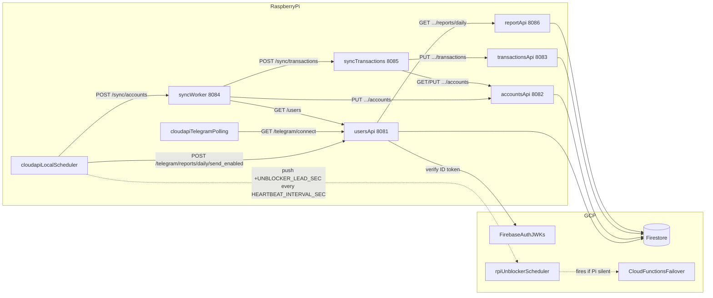

# CloudApi Local Server (Raspberry Pi)

This folder runs the full backend on a Raspberry Pi: each cloud function lives as its own local HTTP service, the scheduler triggers them via loopback URLs, and Cloud Firestore (plus Firebase Auth's public JWKs) is the only remaining cloud dependency in the hot path. The deployed Cloud Functions remain provisioned as a passive fallback that activates only when the Pi stops heart-beating.

## What It Does

- **Hosts every backend service locally** as a per-function HTTP server (`functions-framework`) on `127.0.0.1`:

  | Service              | Port  | Source                                                   |
  | -------------------- | ----- | -------------------------------------------------------- |
  | `users_api`          | 8081  | [functions/users_api/main.py](../functions/users_api/main.py)               |
  | `accounts_api`       | 8082  | [functions/accounts_api/main.py](../functions/accounts_api/main.py)         |
  | `transactions_api`   | 8083  | [functions/transactions_api/main.py](../functions/transactions_api/main.py) |
  | `sync_worker`        | 8084  | [functions/sync_worker/main.py](../functions/sync_worker/main.py)           |
  | `sync_transactions`  | 8085  | [functions/sync_transactions/main.py](../functions/sync_transactions/main.py) |
  | `report_api`         | 8086  | [functions/report_api/main.py](../functions/report_api/main.py)             |
  | `local_server` admin | 8088  | [local_server/src/local_server/main.py](src/local_server/main.py)           |

- **Hosts the admin panel and sync API** (`cloudapi-local.service`) as a FastAPI/uvicorn app on port 8088:
  - `/admin` — SQLAdmin web UI (jars, cards, transactions, monthly report, sync panel)
  - `/sync/*` — account and transaction sync endpoints
  - `/healthz` — health check
- **Runs the Telegram bot in polling mode** as `cloudapi-telegram.service` (no inbound webhook needed).
- **Falls back automatically**: if the Pi stops pushing the unblocker, GCP wakes the cloud `users_api`, which resumes the cloud schedulers and re-points the Telegram webhook to the cloud `telegram_bot` function.

## Architecture



## Prerequisites

- Raspberry Pi OS 64-bit (recommended)
- Either Docker + Docker Compose plugin (containerized run), or bare-metal **systemd + pyenv** (Python comes from pyenv; no apt `python3-venv` required for that path)
- GCP service account key with Scheduler permissions at `/etc/cloudapi/sa.json`
- Environment file at `/etc/cloudapi/local_server.env`

## Credentials Management

Store secrets outside git:

- `/etc/cloudapi/sa.json` (chmod `600`)
- `/etc/cloudapi/local_server.env` (chmod `600`)

Required values:

- `GOOGLE_APPLICATION_CREDENTIALS=/etc/cloudapi/sa.json`
- `GCP_PROJECT_ID`, `GCP_SCHEDULER_REGION`
- `INTERNAL_API_KEY`
- `TELEGRAM_BOT_TOKEN` (`TELEGRAM_BOT_USERNAME` if you generate connect links)
- `TELEGRAM_WEBHOOK_URL` (only required for failover; the cloud unblocker re-points Telegram back to the deployed `telegram_bot` function)
- Cloud scheduler job names (`CLOUD_UNBLOCKER_JOB`, `CLOUD_SYNC_WORKER_JOB`, `CLOUD_DAILY_REPORTS_JOB`)
- **Local service URLs (loopback)** — these are the new defaults that point cron and inter-service calls at the per-function processes on the Pi:
  - `USERS_API_URL=http://127.0.0.1:8081`
  - `ACCOUNTS_API_URL=http://127.0.0.1:8082`
  - `TRANSACTIONS_API_URL=http://127.0.0.1:8083`
  - `SYNC_WORKER_URL=http://127.0.0.1:8084`
  - `SYNC_TRANSACTIONS_URL=http://127.0.0.1:8085`
  - `REPORT_API_URL=http://127.0.0.1:8086`
- Optional: `GEMINI_API_KEY` (only needed if `report_api` should run LLM summarisation).

Use `local_server/.env.example` as the template.

## Run (Docker, dev / Pi quickstart)

`local_server/docker-compose.yml` ships eight services: the six per-function HTTP services (`users_api`, `accounts_api`, `transactions_api`, `sync_worker`, `sync_transactions`, `report_api`), the `scheduler` (APScheduler + heartbeat), and `telegram_polling`. Ports `8081–8086` and `9090` are bound to `127.0.0.1` only.

1. Copy env:
   - `cp local_server/.env.example local_server/.env`
   - Fill values (or symlink to `/etc/cloudapi/local_server.env`)
2. Provision the service-account key for Docker:
   - The compose file mounts `local_server/secrets/` into each container at `/etc/cloudapi:ro`.
   - Place the GCP service-account JSON at `local_server/secrets/sa.json` (chmod `600`).
   - Contents of `secrets/` are git-ignored.
3. Start everything:
   - `cd local_server`
   - `docker compose up -d --build`
4. Smoke-test:
   - `for p in 8081 8082 8083 8084 8085 8086; do curl -fsS http://127.0.0.1:$p/ | head -c 200; echo; done`
   - `curl -fsS http://127.0.0.1:9090/healthz`

Note: `TELEGRAM_WEBHOOK_URL` is only required for failover (the unblocker re-points
Telegram to the cloud webhook). If unset, the local server will still run; webhook
ops are skipped gracefully.

## Run (bare-metal Raspberry Pi, systemd + pyenv)

For long-running production-style deploys without Docker. Tested on Raspberry Pi OS Bookworm 64-bit. Assumes [pyenv](https://github.com/pyenv/pyenv) is already installed under your normal Linux user. The service runs as that same user — pyenv is per-user, so we don't introduce a separate system user.

These docs assume the repo lives under **`ironcow`** at **`/home/ironcow/Projects/MonoProjectCloud`** (adjust `DEPLOY_*` if your layout differs). Export once per shell (or add to `~/.bashrc`):

```bash
export DEPLOY_USER="ironcow"
export DEPLOY_HOME="/home/ironcow"
export APP_DIR="${DEPLOY_HOME}/Projects/MonoProjectCloud"
export PY_VERSION="3.11.10"
```

Every command below uses `$APP_DIR`, `$DEPLOY_USER`, and `$PY_VERSION`.

### 1. System prep

```bash
sudo apt update
sudo apt install -y git
sudo mkdir -p /etc/cloudapi
sudo chown root:${DEPLOY_USER} /etc/cloudapi
sudo chmod 750 /etc/cloudapi
```

Pyenv supplies Python (including `venv`); no `apt install python3-venv` is required for this path.

### 2. Make sure pyenv has the right Python

Run as **`${DEPLOY_USER}`** (SSH as `ironcow`, not root):

```bash
pyenv --version                  # sanity check; pyenv must be on PATH
pyenv install -s "${PY_VERSION}" # idempotent: skip if already installed
```

### 3. Clone or sync the repo into `$APP_DIR`

First-time clone:

```bash
mkdir -p "$(dirname "${APP_DIR}")"
git clone https://github.com/<you>/MonoProjectCloud.git "${APP_DIR}"
cd "${APP_DIR}"
pyenv local "${PY_VERSION}"    # writes ${APP_DIR}/.python-version
```

Use your real Git remote URL if the repo name differs (for example `CloudApi.git`).

If you already keep the tree elsewhere, sync `local_server/` and `functions/` so they sit directly under `${APP_DIR}` (same layout as this Git repo).

After `pyenv local`, `python` and `python -m venv` inside `"${APP_DIR}"` resolve to the pyenv-managed interpreter via shims.

### 4. Create the virtual environment and install deps using `uv`

Using `uv` is recommended for extremely fast dependency installation and virtualenv management.

```bash
cd "${APP_DIR}"
uv venv .venv
uv pip install -e "./local_server[test]" --python .venv/bin/python
```

The venv records an absolute path to the pyenv interpreter, so systemd can call `"${APP_DIR}/.venv/bin/python"` directly without pyenv shims at runtime.

`pyproject.toml` pins every transitive dep the imported cloud-function code needs (`functions-framework`, `loguru`, `requests`, `flask`, ...), so this single install line is enough.

### 5. Drop credentials into `/etc/cloudapi/`

From `"${APP_DIR}"`, run with `sudo`:

```bash
cd "${APP_DIR}"
sudo install -o root -g ${DEPLOY_USER} -m 640 ./local_server.env /etc/cloudapi/local_server.env
sudo install -o root -g ${DEPLOY_USER} -m 640 ./sa.json          /etc/cloudapi/sa.json
```

Use real filenames if yours differ (e.g. copy from `local_server/.env.example`). `GOOGLE_APPLICATION_CREDENTIALS=/etc/cloudapi/sa.json` must be set inside `/etc/cloudapi/local_server.env`.

### 6. Install the systemd units

The shipped units in `local_server/systemd/` are aligned with **`ironcow`** and **`/home/ironcow/Projects/MonoProjectCloud`**. If you changed `DEPLOY_USER` / `APP_DIR`, edit `User=`, `Group=`, `WorkingDirectory=`, `Environment=PYTHONPATH=`, and `ExecStart=` paths in every unit file before copying.

```bash
# 1) Per-function HTTP services + their target
sudo cp "${APP_DIR}"/local_server/systemd/cloudapi-{users-api,accounts-api,transactions-api,sync-worker,sync-transactions,report-api}.service /etc/systemd/system/
sudo cp "${APP_DIR}/local_server/systemd/cloudapi-services.target" /etc/systemd/system/

# 2) Scheduler + (optional) Telegram polling
sudo cp "${APP_DIR}/local_server/systemd/cloudapi-local.service"    /etc/systemd/system/
sudo cp "${APP_DIR}/local_server/systemd/cloudapi-telegram.service" /etc/systemd/system/

sudo systemctl daemon-reload

# 3) Enable + start: services first, then the scheduler (which depends on them).
sudo systemctl enable --now cloudapi-services.target
sudo systemctl enable --now cloudapi-local.service
# Optional — local Telegram polling:
# sudo systemctl enable --now cloudapi-telegram.service
```

`cloudapi-services.target` is a passive grouping unit. The six service units use `PartOf=cloudapi-services.target` so `systemctl stop cloudapi-services.target` stops all of them in one shot, and `cloudapi-local.service` declares `Wants=`/`After=cloudapi-services.target` so a reboot brings the HTTP services up before the scheduler.

### 7. Verify

```bash
# Each function exposes a small JSON index at GET /:
for p in 8081 8082 8083 8084 8085 8086; do
  echo -n "$p: "; curl -fsS http://127.0.0.1:$p/ | head -c 200; echo
done

# Admin server (cloudapi-local.service) health + admin panel:
curl -fsS http://127.0.0.1:8088/healthz
curl -fsI http://127.0.0.1:8088/admin   # should return 200 or redirect to /admin/
journalctl -u cloudapi-local.service -f
```

### 8. Update service after code changes on the Pi

Run these steps any time you `git push` new code (e.g. changes to `admin.py`, routers, models):

```bash
cd "${APP_DIR}"

# 1. Pull latest code
git pull

# 2. Sync Python dependencies (fast, only installs what changed)
uv pip install -e "./local_server[test]" --python .venv/bin/python

# 3a. Restart the per-function HTTP services (ports 8081–8086)
#     Only needed if you changed code under functions/ or local_server routers
sudo systemctl restart cloudapi-services.target

# 3b. Restart the admin server (port 8088)
#     Always needed for changes to local_server/ (admin.py, models, routers, etc.)
sudo cp "${APP_DIR}/local_server/systemd/cloudapi-local.service" /etc/systemd/system/
sudo systemctl daemon-reload          # only needed if the .service file itself changed
sudo systemctl restart cloudapi-local.service

# 4. Verify
sudo systemctl status cloudapi-local.service
curl -fsS http://127.0.0.1:8088/healthz
curl -fsI http://127.0.0.1:8088/admin
```

If you bump Python: `pyenv install -s 3.11.<new>`, edit `.python-version`, then `rm -rf .venv && uv venv .venv && uv pip install -e "./local_server[test]" --python .venv/bin/python`, then restart both targets above.

## Verify

- Admin server health: `curl http://localhost:8088/healthz`
- Admin panel: `curl -fsI http://localhost:8088/admin` (expect 200 or redirect)
- Per-function services: `for p in 8081 8082 8083 8084 8085 8086; do echo -n "$p: "; curl -fsS http://127.0.0.1:$p/ | head -c 200; echo; done`

## Manual Failover Test

1. Stop Pi services:
   - Docker: `cd local_server && docker compose down`
   - systemd: `sudo systemctl stop cloudapi-local.service cloudapi-services.target cloudapi-telegram.service` (omit telegram unit if unused)
2. Wait for `rpi-unblocker` to fire (~`UNBLOCKER_LEAD_SEC`).
3. Confirm cloud schedulers (`sync-worker-hourly`, `daily-reports-daily`) are resumed and the Telegram webhook is set back to the cloud `telegram_bot` function.
4. Start Pi again:
   - Docker: `docker compose up -d`
   - systemd: `sudo systemctl start cloudapi-services.target cloudapi-local.service` (and `cloudapi-telegram.service` if used)
5. Confirm cloud schedulers are paused again, the webhook is deleted, and the Pi resumes its heartbeat.

## Rollback To Cloud-Only

1. Stop local server.
2. Set `paused = false` for cloud scheduler jobs in Terraform.
3. `terraform apply` in `tf/`.
4. Keep webhook pointing to cloud Telegram function.

## Credentials Rotation

- Rotate `INTERNAL_API_KEY` in Terraform and local env together.
- Rotate Telegram token in bot settings, then update:
  - Terraform vars
  - `/etc/cloudapi/local_server.env`
- Rotate service account key:
  - create new key
  - replace `/etc/cloudapi/sa.json`
  - delete old key in GCP IAM.
