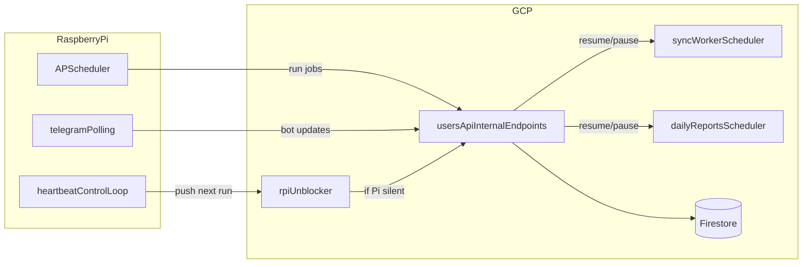

# CloudApi Local Server (Raspberry Pi)

This folder runs scheduled jobs and internal automation on a Raspberry Pi while keeping Cloud Functions and Firestore in GCP as fallback and source of truth.

## What It Does

- Runs local cron jobs:
  - sync accounts (`sync_worker` logic)
  - daily Telegram reports trigger
- Runs Telegram bot in polling mode locally.
- Maintains a heartbeat by pushing the cloud `rpi-unblocker` scheduler job into the future every cycle.
- If the Pi goes offline, the unblocker fires and cloud resumes scheduler-driven processing.

## Architecture

## Prerequisites

- Raspberry Pi OS 64-bit (recommended)
- Docker + Docker Compose plugin
- GCP service account key with Scheduler permissions at `/etc/cloudapi/sa.json`
- Environment file at `/etc/cloudapi/local_server.env`

## Credentials Management

Store secrets outside git:

- `/etc/cloudapi/sa.json` (chmod `600`)
- `/etc/cloudapi/local_server.env` (chmod `600`)

Required values:

- `GOOGLE_APPLICATION_CREDENTIALS=/etc/cloudapi/sa.json`
- `GCP_PROJECT_ID`, `GCP_SCHEDULER_REGION`
- `INTERNAL_API_KEY`
- `TELEGRAM_BOT_TOKEN`
- `TELEGRAM_WEBHOOK_URL` (cloud webhook URL for failover mode)
- Cloud scheduler job names (`CLOUD_UNBLOCKER_JOB`, `CLOUD_SYNC_WORKER_JOB`, `CLOUD_DAILY_REPORTS_JOB`)

Use `local_server/.env.example` as the template.

## Run

1. Copy env:
   - `cp local_server/.env.example local_server/.env`
   - Fill values (or symlink to `/etc/cloudapi/local_server.env`)
2. Start services:
   - `cd local_server`
   - `docker compose up -d --build`

## Verify

- Health:
  - `curl http://localhost:9090/healthz`
- Heartbeat movement:
  - `gcloud scheduler jobs describe rpi-unblocker --location=europe-west1`
  - Verify upcoming run keeps moving forward.

## Manual Failover Test

1. Stop Pi services:
   - `cd local_server && docker compose down`
2. Wait for `rpi-unblocker` to fire.
3. Confirm cloud schedulers are resumed and webhook is restored.
4. Start Pi again:
   - `docker compose up -d`
5. Confirm cloud schedulers are paused again and Pi resumes heartbeat.

## Rollback To Cloud-Only

1. Stop local server.
2. Set `paused = false` for cloud scheduler jobs in Terraform.
3. `terraform apply` in `tf/`.
4. Keep webhook pointing to cloud Telegram function.

## Credentials Rotation

- Rotate `INTERNAL_API_KEY` in Terraform and local env together.
- Rotate Telegram token in bot settings, then update:
  - Terraform vars
  - `/etc/cloudapi/local_server.env`
- Rotate service account key:
  - create new key
  - replace `/etc/cloudapi/sa.json`
  - delete old key in GCP IAM.
