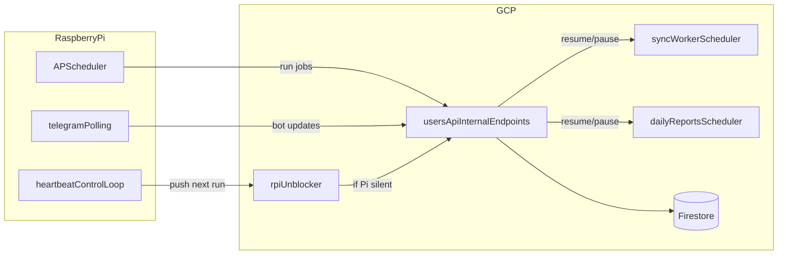

# CloudApi Local Server (Raspberry Pi)

This folder runs scheduled jobs and internal automation on a Raspberry Pi while keeping Cloud Functions and Firestore in GCP as fallback and source of truth.

## What It Does

- Runs local cron jobs:
  - sync accounts (`sync_worker` logic)
  - daily Telegram reports trigger
- Runs Telegram bot in polling mode locally.
- Maintains a heartbeat by pushing the cloud `rpi-unblocker` scheduler job into the future every cycle.
- If the Pi goes offline, the unblocker fires and cloud resumes scheduler-driven processing.

## Architecture



## Prerequisites

- Raspberry Pi OS 64-bit (recommended)
- Either Docker + Docker Compose plugin (containerized run), or bare-metal **systemd + pyenv** (Python comes from pyenv; no apt `python3-venv` required for that path)
- GCP service account key with Scheduler permissions at `/etc/cloudapi/sa.json`
- Environment file at `/etc/cloudapi/local_server.env`

## Credentials Management

Store secrets outside git:

- `/etc/cloudapi/sa.json` (chmod `600`)
- `/etc/cloudapi/local_server.env` (chmod `600`)

Required values:

- `GOOGLE_APPLICATION_CREDENTIALS=/etc/cloudapi/sa.json`
- `GCP_PROJECT_ID`, `GCP_SCHEDULER_REGION`
- `INTERNAL_API_KEY`
- `TELEGRAM_BOT_TOKEN`
- `TELEGRAM_WEBHOOK_URL` (cloud webhook URL for failover mode)
- Cloud scheduler job names (`CLOUD_UNBLOCKER_JOB`, `CLOUD_SYNC_WORKER_JOB`, `CLOUD_DAILY_REPORTS_JOB`)

Use `local_server/.env.example` as the template.

## Run (Docker, dev / Pi quickstart)

1. Copy env:
   - `cp local_server/.env.example local_server/.env`
   - Fill values (or symlink to `/etc/cloudapi/local_server.env`)
2. Provision the service-account key for Docker:
   - The compose file mounts `local_server/secrets/` into the container at `/etc/cloudapi:ro`.
   - Place the GCP service-account JSON at `local_server/secrets/sa.json` (chmod `600`).
   - Contents of `secrets/` are git-ignored.
3. Start services:
   - `cd local_server`
   - `docker compose up -d --build`

Note: `TELEGRAM_WEBHOOK_URL` is only required for failover (the unblocker re-points
Telegram to the cloud webhook). If unset, the local server will still run; webhook
ops are skipped gracefully.

## Run (bare-metal Raspberry Pi, systemd + pyenv)

For long-running production-style deploys without Docker. Tested on Raspberry Pi OS Bookworm 64-bit. Assumes [pyenv](https://github.com/pyenv/pyenv) is already installed under your normal Linux user. The service runs as that same user — pyenv is per-user, so we don't introduce a separate system user.

These docs assume the repo lives under **`ironcow`** at **`/home/ironcow/Projects/MonoProjectCloud`** (adjust `DEPLOY_*` if your layout differs). Export once per shell (or add to `~/.bashrc`):

```bash
export DEPLOY_USER="ironcow"
export DEPLOY_HOME="/home/ironcow"
export APP_DIR="${DEPLOY_HOME}/Projects/MonoProjectCloud"
export PY_VERSION="3.11.10"
```

Every command below uses `$APP_DIR`, `$DEPLOY_USER`, and `$PY_VERSION`.

### 1. System prep

```bash
sudo apt update
sudo apt install -y git
sudo mkdir -p /etc/cloudapi
sudo chown root:${DEPLOY_USER} /etc/cloudapi
sudo chmod 750 /etc/cloudapi
```

Pyenv supplies Python (including `venv`); no `apt install python3-venv` is required for this path.

### 2. Make sure pyenv has the right Python

Run as **`${DEPLOY_USER}`** (SSH as `ironcow`, not root):

```bash
pyenv --version                  # sanity check; pyenv must be on PATH
pyenv install -s "${PY_VERSION}" # idempotent: skip if already installed
```

### 3. Clone or sync the repo into `$APP_DIR`

First-time clone:

```bash
mkdir -p "$(dirname "${APP_DIR}")"
git clone https://github.com/<you>/MonoProjectCloud.git "${APP_DIR}"
cd "${APP_DIR}"
pyenv local "${PY_VERSION}"    # writes ${APP_DIR}/.python-version
```

Use your real Git remote URL if the repo name differs (for example `CloudApi.git`).

If you already keep the tree elsewhere, sync `local_server/` and `functions/` so they sit directly under `${APP_DIR}` (same layout as this Git repo).

After `pyenv local`, `python` and `python -m venv` inside `"${APP_DIR}"` resolve to the pyenv-managed interpreter via shims.

### 4. Create the venv and install deps

```bash
cd "${APP_DIR}"
python -m venv .venv
.venv/bin/pip install --upgrade pip
.venv/bin/pip install -e local_server
```

The venv records an absolute path to the pyenv interpreter, so systemd can call `"${APP_DIR}/.venv/bin/python"` directly without pyenv shims at runtime.

`pyproject.toml` pins every transitive dep the imported cloud-function code needs (`functions-framework`, `loguru`, `requests`, `flask`, ...), so this single install line is enough.

### 5. Drop credentials into `/etc/cloudapi/`

From `"${APP_DIR}"`, run with `sudo`:

```bash
cd "${APP_DIR}"
sudo install -o root -g ${DEPLOY_USER} -m 640 ./local_server.env /etc/cloudapi/local_server.env
sudo install -o root -g ${DEPLOY_USER} -m 640 ./sa.json          /etc/cloudapi/sa.json
```

Use real filenames if yours differ (e.g. copy from `local_server/.env.example`). `GOOGLE_APPLICATION_CREDENTIALS=/etc/cloudapi/sa.json` must be set inside `/etc/cloudapi/local_server.env`.

### 6. Install the systemd unit(s)

The shipped units in `local_server/systemd/` are aligned with **`ironcow`** and **`/home/ironcow/Projects/MonoProjectCloud`**. If you changed `DEPLOY_USER` / `APP_DIR`, edit `User=`, `Group=`, `WorkingDirectory=`, `Environment=PYTHONPATH=`, and both `ExecStart=` paths in the unit files before copying.

```bash
sudo cp "${APP_DIR}/local_server/systemd/cloudapi-local.service"    /etc/systemd/system/
# Optional — Telegram polling locally:
sudo cp "${APP_DIR}/local_server/systemd/cloudapi-telegram.service" /etc/systemd/system/
sudo systemctl daemon-reload
sudo systemctl enable --now cloudapi-local.service
# sudo systemctl enable --now cloudapi-telegram.service
```

### 7. Verify

```bash
systemctl status cloudapi-local.service
journalctl -u cloudapi-local.service -f
curl http://localhost:9090/healthz
```

Expect `Local scheduler started` and the `rpi-unblocker` job's next run advancing every cycle (`gcloud scheduler jobs describe rpi-unblocker --location=europe-west1`).

### 8. Update / rollback on the Pi

```bash
cd "${APP_DIR}"
git pull
.venv/bin/pip install -e local_server
sudo systemctl restart cloudapi-local.service
```

If you bump Python: `pyenv install -s 3.11.<new>`, edit `.python-version`, then `rm -rf .venv && python -m venv .venv && .venv/bin/pip install -e local_server`, then `sudo systemctl restart cloudapi-local.service`.

## Verify

- Health:
  - `curl http://localhost:9090/healthz`
- Heartbeat movement:
  - `gcloud scheduler jobs describe rpi-unblocker --location=europe-west1`
  - Verify upcoming run keeps moving forward.

## Manual Failover Test

1. Stop Pi services:
   - Docker: `cd local_server && docker compose down`
   - systemd: `sudo systemctl stop cloudapi-local.service cloudapi-telegram.service` (omit telegram unit if unused)
2. Wait for `rpi-unblocker` to fire.
3. Confirm cloud schedulers are resumed and webhook is restored.
4. Start Pi again:
   - Docker: `docker compose up -d`
   - systemd: `sudo systemctl start cloudapi-local.service` (and `cloudapi-telegram.service` if used)
5. Confirm cloud schedulers are paused again and Pi resumes heartbeat.

## Rollback To Cloud-Only

1. Stop local server.
2. Set `paused = false` for cloud scheduler jobs in Terraform.
3. `terraform apply` in `tf/`.
4. Keep webhook pointing to cloud Telegram function.

## Credentials Rotation

- Rotate `INTERNAL_API_KEY` in Terraform and local env together.
- Rotate Telegram token in bot settings, then update:
  - Terraform vars
  - `/etc/cloudapi/local_server.env`
- Rotate service account key:
  - create new key
  - replace `/etc/cloudapi/sa.json`
  - delete old key in GCP IAM.
